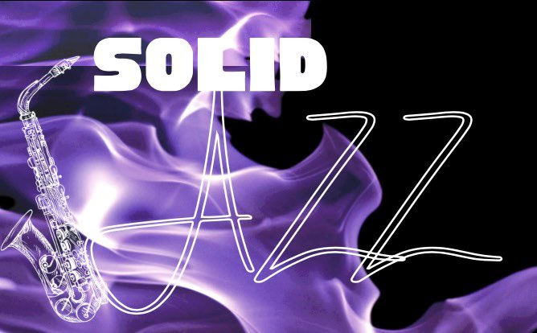
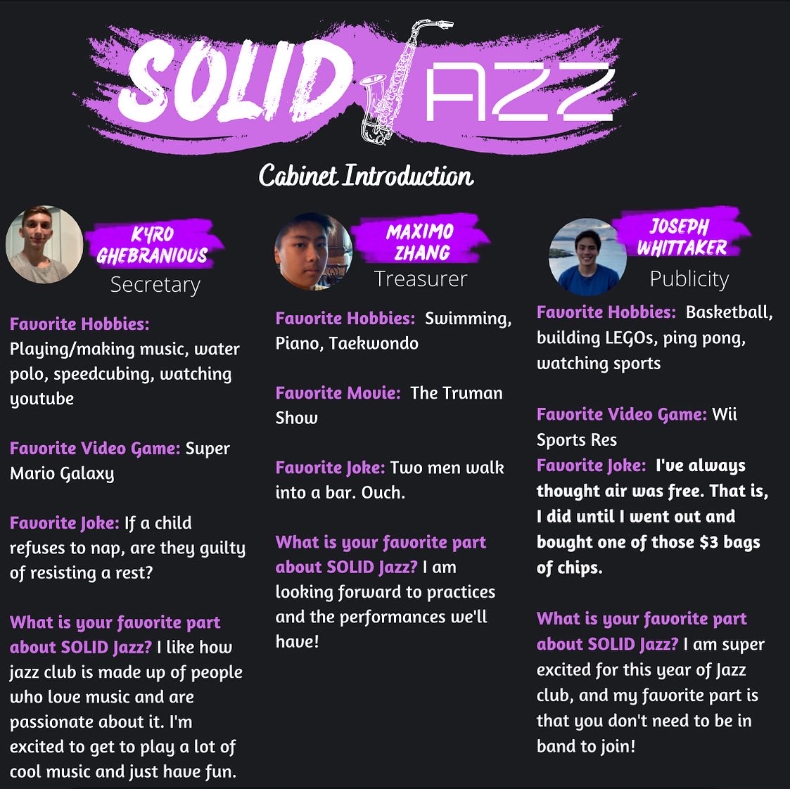

# Welcome to the SOLID Jazz page!

SOLID Jazz is a club in Whitney High School dedicated to performing jazz music! The club has existed since 2020, so this is our third year on campus! If you play an instrument and is interested in learning jazz music, then this club is perfect for you. You don't have to be enrolled in a music class at Whitney or even play a jazz instrument to join the band. You can join the club by clicking [here](https://forms.gle/gj6mPCMLAC7Lpu3c7).
## What is our goal?
SOLID is actually an acronym! 
- S- Supporters of the music program
- O- One united jazz club
- L- Learners of jazz music and culture
- I- Inspirations to the world
- D- Dedicated to perform to the community

We provide service to our community with our many performances throughout the year! We perform at school concerts, talent show, and the annual district jazz festival at Artesia High School. 

## Meet the 2022-2023 cabinet!
.jpg)

## Rehearsals
Since we do a lot of performances, it means that we have to practice together. These practices are led by our wonderful band teacher and advisor, Mr. Clements. This club is a commitment, so it is crucial that you show up to most of our practices in order to perform. We meet during lunch on Monday and Wednesdays. Each rehearsal lasts only fo 15-20 minutes, therefore it is also highly recommended that you practice the music outside of school. 

## Tentative Performance Dates for the 2022-2023 School Year
- Winter Concert- December 20/21
- Talent Show- February 
- Jazz Festival- March
- Spring Concert- May 24/25

## Previous Performances
### 2020-2021

#### Winter Concert
- Watermelon Man by Herbie Hancock (arranged by Mike Kamuf)
- A Charlie Brown Christmas by Vince Guaraldi (arranged by Paul Murtha)
- Jingle Bell Rock by Joe Beal and Jim Booth (arranged by Jerry Nowak
- Let it Snow! Let it Snow! Let it Snow! by Jule Styne (arranged by Alan Baylock)

#### April Fools Event
- Never Gonna Give You Up by Rick Astley (Arranged by Esther Vadillo and Melinda Wu)

#### Spring Concert
- Caravan by Duke Ellington, Irving Mills, and Jaun Tizol (arranged by Michael Sweeney)
- In the Mood by Glenn Miller (arranged by Joe Garland)
- Chili Today, Hot Tamale by Rick Hirsch 

#### Talent Show
- Birdland by Josef Zawinul (arranged by Michael Sweeney)

#### End of the Year Concert
- Jump Up Superstar by Mahito Yokota (arranged by Kyro Ghebranious)
- The Chicken by Alfred Ellis (arranged by Mike Story)
- Ornithology by Charlie Parker and Benny Harris (arranged by Greg Yasinitsky)

### 2021-2022

#### Winter Concert
- Fly me to the Moon
- Deck the Halls arranged by Mike Collins-Dowden

#### Talent Show
- Fly me to the Moon
- Traces by Buddy Buie, J. R. Cobb, and Emory Gordy Jr.
- Mr. P.C. by John Coltrane (arranged by Terry White)

#### District Jazz Festival
- Traces by Buddy Buie, J. R. Cobb, and Emory Gordy Jr.
- Mr. P.C. by John Coltrane (arranged by Terry White)

#### Spring Concert
- Traces by Buddy Buie, J. R. Cobb, and Emory Gordy Jr.
- Mr. P.C. by John Coltrane (arranged by Terry White)
- Steam Gardens by Koji Kondo (arranged by Kyro Ghebranious)
- Chili Today, Hot Tamale by Rick Hirsch 
- Never Gonna Give You Up by Rick Astley (Arranged by Esther Vadillo and Melinda Wu)
